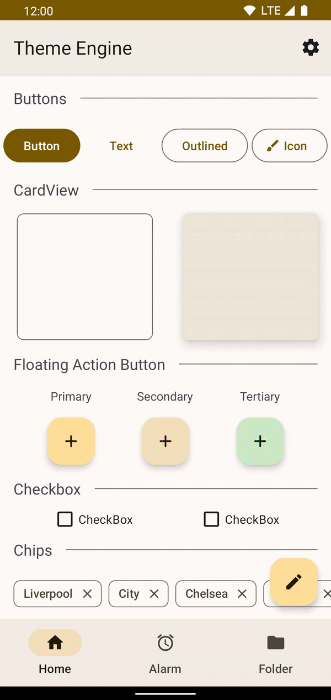
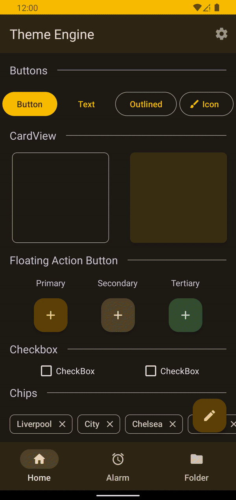
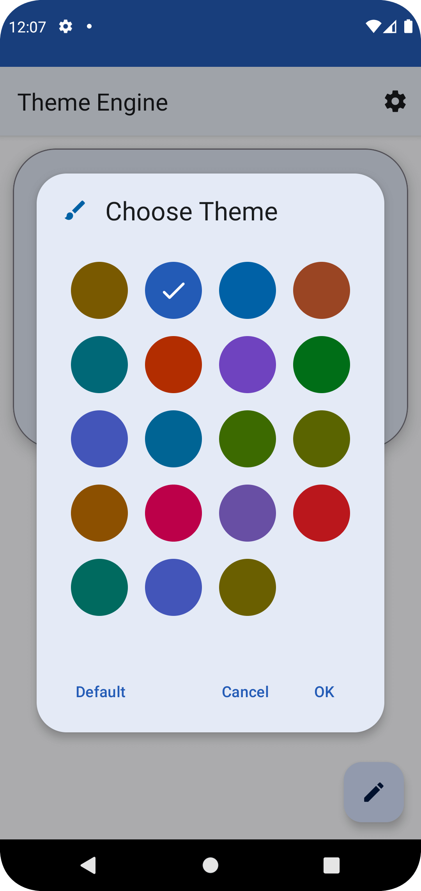
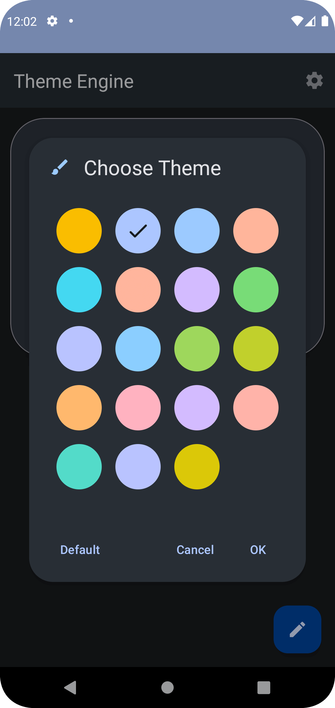

# A Material Design 3 Theme Engine for Android
[](https://github.com/prathameshmm02/ThemeEngine/actions/workflows/android.yml)
[](https://search.maven.org/search?q=g:%22io.github.prathameshmm02.themeEngine%22%20AND%20a:%22themeEngine%22)
[](https://opensource.org/licenses/Apache-2.0)

This library allows you to set Material 3 themes to your app. You can also manage dark mode and dynamic colors in your app. All changes are saved to SharedPreferences no need to manage it manually.

<b>Note</b>: This library does not support dynamic colors on devices lower than Android 12 i.e. API 31.

## Screenshots
### Themes 
| Light | Dark |
|:---:|:---:|
| | |
### Theme Chooser
| Light | Dark |
|:---:|:---:|
| | |

## How to use
### Getting Started
Add the following gradle dependency to your build.gradle
```gradle
dependencies {
  implementation 'io.github.prathameshmm02.themeEngine:themeEngine:1.0'
}
```
### Usage
Theming is handled by ThemeEngine class. It is a singleton class and you can get the ThemeEngine instance as follows:
```kotlin
val themeEngine = ThemeEngine.getInstance(context)
```

Apply theme and night mode to given activity, in your activity's onCreate() method, call:
```kotlin
themeEngine.applyToActivity(this)
```

Apply theme and night mode to all activities by registering a ActivityLifecycleCallbacks to your application. In your application class’ onCreate() method, call:
```kotlin
themeEngine.applyToActivities(this)
```

Set Dark theme 
>Note : Dark theme change is handled no need to call activity.recreate()
```kotlin
// Light mode
themeEngine.themeMode = ThemeMode.LIGHT

// Dark mode
themeEngine.themeMode = ThemeMode.DARK

// Follow System
themeEngine.themeMode = ThemeMode.AUTO
```
    
Set Dynamic Colors, you may want to recreate activity after settings this property
```kotlin
themeEngine.isDynamicTheme = true
```

Set static theme
> The theme used when dynamic color is disabled
```kotlin
themeEngine.staticTheme = R.style.Theme_ThemeEngine_Orange
```

Create ThemeChooserDialog for the user to choose static theme from, this returns an AlertDialog.
```kotlin
ThemeChooserDialogBuilder(this)

    // Set Title
    .setTitle(R.string.choose_theme)
    
    // Set positive button text and an OnClickListener on the button
    .setPositiveButton("OK") { position, theme ->
      // This sets staticTheme
      themeEngine.staticTheme = theme
      recreate()
    }
    
    // Set negative button text
    .setNegativeButton("Cancel")
    
    // Set neutral button text and an OnClickListener on the button
    .setNeutralButton("Default") { _, _ ->
        // This resets static theme
        themeEngine.resetTheme()
        // Recreates activity
        recreate()
    }
    
    // Set Dialog Icon
    .setIcon(R.drawable.ic_round_brush)
    
    // Create Alert Dialog
    .create()
    // Show Dialog
    .show()
```
  
Get current app theme, this returns a dynamic theme when dynamic color is enabled, a static theme otherwise.
```kotlin
val theme = themeEngine.getTheme()
```

Reset static theme to default 
```kotlin
themeEngine.resetTheme()
```

## Working
ThemeOverlays are used to apply theme colors to activities. This library contains 20 ThemeOverlays one of which is Dynamic which is used only when dynamic color is enabled other are used by user's choice.  
The themes are created with [MaterialThemeBuilder](https://material-foundation.github.io/material-theme-builder/#/custom) by using [Material Colors](https://material.io/design/color/the-color-system.html#tools-for-picking-colors).
